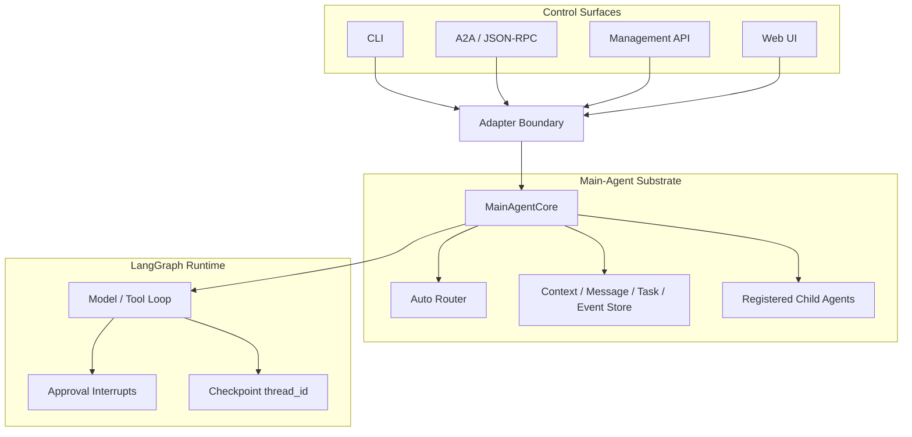
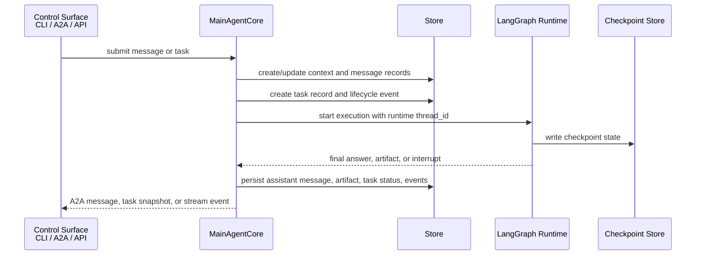
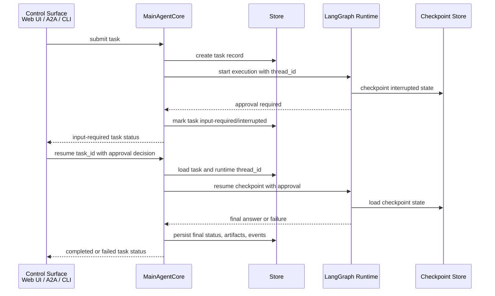

# Vermay Agent

[English](README.md) | [简体中文](README.zh-CN.md)

Vermay Agent 是一个基于 A2A 协议的本地主 Agent runtime。它提供一个主 agent，可以：

- 以 message 方式直接回答轻量请求；
- 运行由 LangGraph 支撑的本地 task，并支持 events、artifacts、审批中断、取消和恢复；
- 将合适的请求路由到已注册的子 A2A agent；
- 提供浏览器 workbench，用于查看会话记录、路由诊断、任务事件、payload 和审批操作。

客户端通过 `/rpc` endpoint 使用 A2A JSON-RPC 与 agent 通信。

## 架构

项目将 protocol、task state 和 runtime execution 分成独立层。



关键标识：

| 概念 | 含义 |
| --- | --- |
| `context_id` / `session_id` | 长生命周期的对话或工作上下文。 |
| `message_id` | context 中的用户或 agent 消息标识。 |
| `task_id` | A2A `Task.id`：一个工作单元及其生命周期的外部标识。A2A client 和 Web UI 使用它获取、取消、订阅或恢复该 task。 |
| `thread_id` | LangGraph runtime 的 `thread_id`：该 task 图执行的 checkpoint key。Vermay Agent 在启动或恢复 LangGraph 时将 `task_id` 映射到它；它既不是 A2A task 标识，也不是对话或 session 标识。 |

一个 session 可以包含多个 task，每个可恢复的 task 都有自己的 `thread_id`。为了诊断，runtime thread 可能出现在本地 CLI 或 inspector 输出中；但 A2A client 应始终使用 `task_id` 标识和恢复工作。发生 approval interrupt 时，`MainAgentCore` 先将 `task_id` 解析为 `thread_id`，再恢复 checkpointed LangGraph execution。

### Task 执行流程

正常执行从一个控制入口开始，转换成带生命周期管理的 task，然后进入 LangGraph runtime。公开的 task record 和 event stream 保持在原始 graph state 之外。



### Approval Resume 流程

Approval interrupt 会保持 `task_id` 和 `thread_id` 分离。调用方恢复外部可见的 `task_id`；main-agent 层查找内部 checkpoint thread 并恢复 runtime。



## Web UI

当前 Web UI 是一个 chat-first 的 Agent Console：左侧是 sessions，中间是对话记录和输入框，右侧是 inspector，用于查看路由诊断、任务事件、agent cards、child agents 和 payloads。


前端位于 `web/`，是一个独立的 Next.js app。它和后端放在同一个仓库中，便于 A2A contracts、task events、approval flows 和 inspector behavior 一起演进。

## 安装

```bash
python3 -m venv .venv
source .venv/bin/activate
python -m pip install --upgrade pip
python -m pip install -e .
```

需要 Python 3.11 或更高版本。

## CLI 快速开始

```bash
vermay-agent "weather forecast for Beijing"
```

CLI 会把 progress 输出到 stderr，把最终回答输出到 stdout。

关闭 progress 输出：

```bash
vermay-agent "weather forecast for Beijing" --no-progress
```

`mini-agent` 命令也会作为 alias 安装。

## 启动后端

```bash
source .venv/bin/activate
vermay-agent serve
```

默认配置：

```text
host: 127.0.0.1
port: 8000
```

`serve` 默认暴露 A2A 服务。只有当你只想运行本地 management APIs，且不需要 agent 通信入口时，才禁用 A2A：

```bash
vermay-agent serve --disable-a2a
```

健康检查：

```bash
curl http://127.0.0.1:8000/health
```

服务默认只绑定本机，并且不添加认证。绑定到 localhost 之外前需要谨慎。

## 启动 Web UI

在另一个 terminal 中：

```bash
cd web
pnpm install
pnpm dev
```

Web app 默认运行在 `http://localhost:3000/agent`，并将后端请求代理到 `http://127.0.0.1:8000`。

需要时可以覆盖后端 URL：

```bash
VERMAY_AGENT_API_BASE=http://127.0.0.1:8000 pnpm dev
```

## 后端 Smoke Checks

针对已配置的本地 server 运行后端 smoke checks：

```bash
scripts/a2a_dev_smoke.sh
```

## A2A JSON-RPC 示例

`/rpc` endpoint 接收 A2A JSON-RPC 请求。

发送 direct message：

```bash
curl -X POST http://127.0.0.1:8000/rpc \
  -H 'Content-Type: application/json' \
  -d '{
    "jsonrpc": "2.0",
    "id": "req-1",
    "method": "SendMessage",
    "params": {
      "message": {
        "kind": "message",
        "role": "user",
        "messageId": "msg-1",
        "parts": [{"kind": "text", "text": "tell me a joke"}]
      },
      "metadata": {"executionMode": "message"}
    }
  }'
```

运行 task：

```bash
curl -X POST http://127.0.0.1:8000/rpc \
  -H 'Content-Type: application/json' \
  -d '{
    "jsonrpc": "2.0",
    "id": "req-2",
    "method": "SendMessage",
    "params": {
      "message": {
        "kind": "message",
        "role": "user",
        "messageId": "msg-2",
        "parts": [{"kind": "text", "text": "check k8s status"}]
      },
      "metadata": {"executionMode": "task"}
    }
  }'
```

使用 auto routing：

```bash
curl -X POST http://127.0.0.1:8000/rpc \
  -H 'Content-Type: application/json' \
  -d '{
    "jsonrpc": "2.0",
    "id": "req-3",
    "method": "SendMessage",
    "params": {
      "message": {
        "kind": "message",
        "role": "user",
        "messageId": "msg-3",
        "parts": [{"kind": "text", "text": "delete pod nginx only after approval"}]
      },
      "metadata": {"executionMode": "auto"}
    }
  }'
```

查看 task：

```bash
curl -X POST http://127.0.0.1:8000/rpc \
  -H 'Content-Type: application/json' \
  -d '{"jsonrpc":"2.0","id":"req-4","method":"GetTask","params":{"id":"<task-id>"}}'
```

取消 task：

```bash
curl -X POST http://127.0.0.1:8000/rpc \
  -H 'Content-Type: application/json' \
  -d '{"jsonrpc":"2.0","id":"req-5","method":"CancelTask","params":{"id":"<task-id>","reason":"operator canceled"}}'
```

## 模型配置

模型在 `config/models.json` 中配置。

```json
{
  "primary_model": "local_ollama",
  "router_model": "ollama_gemma4_31b",
  "models": {
    "local_ollama": {
      "provider": "ollama",
      "options": {
        "model": "deepseek-v4-flash:cloud",
        "base_url": "http://127.0.0.1:11434",
        "timeout_seconds": 120
      }
    },
    "ollama_gemma4_31b": {
      "provider": "ollama",
      "options": {
        "model": "gemma4:31b-cloud",
        "base_url": "http://127.0.0.1:11434",
        "timeout_seconds": 120
      }
    }
  }
}
```

`primary_model` 用于普通 message 和 task execution。

`router_model` 由 `executionMode=auto` 使用，用于判断请求应该进入：

- `local_message`；
- `local_task`；
- `remote_agent`。

如果省略 `router_model`，router 会使用 `primary_model`。`VERMAY_AGENT_ROUTER_MODEL` 可以在本地实验时临时覆盖配置中的 router model。

从 CLI 使用另一个已配置模型：

```bash
vermay-agent "weather forecast for Beijing" --model local_ollama
```

## MCP Tools、Resources 和 Prompts

MCP server 配置位于 `config/mcp_servers.json`。

列出已配置能力：

```bash
vermay-agent mcp list-servers
vermay-agent mcp list-tools
vermay-agent mcp list-resources --server k8s
vermay-agent mcp list-prompts --server k8s
```

在 agent run 期间，已配置 MCP servers 默认不启用。需要显式选择 server：

```bash
vermay-agent "check k8s status" --mcp-server k8s
vermay-agent "debug phzou-core service" --mcp-server k8s --mcp-prompt 'k8s-service-health-check?service=phzou-core&namespace=default'
```

选中的 MCP tools 会被包装成 LangChain `StructuredTool`，并使用类似 `mcp__k8s__kubectl_get` 的命名空间名称。除非 server 或 tool 被标记为 read-only，否则 MCP tools 默认需要 approval。

本地 Kubernetes MCP 示例位于 `examples/mcp_servers/k8s/`。它使用 `VERMAY_AGENT_SSH_*` 环境配置。

## Approval 和 Resume

危险工具会暂停执行，并要求显式 approval。

在 Web UI 中，input-required task 会直接在 transcript 中渲染 approval controls。

在交互式 terminal 中，approval 会自动提示：

```bash
vermay-agent "delete pod nginx-5869d7778c-687rb"
```

低层 checkpoint resume 仍可通过 CLI 使用：

```bash
vermay-agent --thread-id <thread-id> --resume-approval true --approval-reason "approved by operator"
```

这条 CLI 命令属于 runtime-level 操作：它通过 `thread_id` 直接恢复 LangGraph checkpoint。A2A 和 Web UI flows 工作在 protocol level，通过外部可见的 `task_id` 恢复。

LangGraph checkpoints 存储在 `data/checkpoints/`。

## Memory

Memory 是显式写入的，并存储在本地 SQLite。

```bash
vermay-agent memory add "Prefer read-only Kubernetes inspection first." --tag k8s --tag preference
vermay-agent memory list
vermay-agent memory disable 1
```

Memory metadata 存储在 `data/agent.sqlite`。

## Skills

Skills 是位于 `skills/` 下的 markdown 文件，包含 front matter：

```markdown
---
name: kubernetes-readonly-debug
description: Read-only Kubernetes status inspection.
triggers: k8s, kubernetes, pods, services
version: 0.1.0
---

Prefer read-only inspection before proposing a fix.
```

常用命令：

```bash
vermay-agent skills list
vermay-agent skills show kubernetes-readonly-debug
vermay-agent skills propose-from-trace --trace traces/latest.jsonl
vermay-agent skills approve <proposal-id>
```

已批准的 skills 位于 `skills/`。生成的 proposals 位于 `data/skill_proposals/`。

## License

Vermay Agent 基于 [MIT License](LICENSE) 发布。
